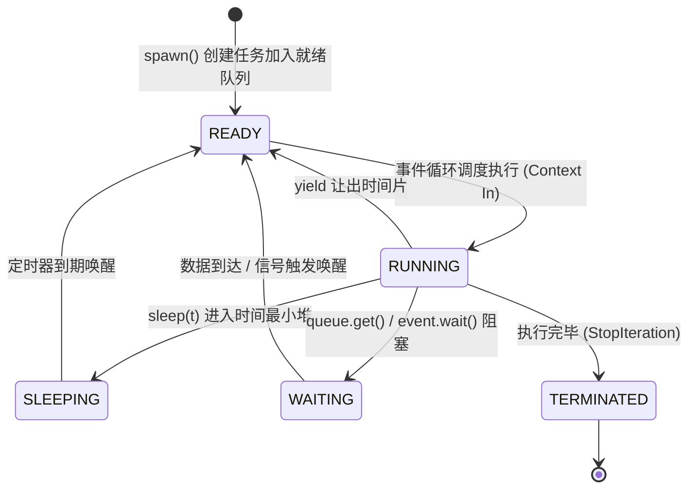

# 🧵 Mini Coroutine Scheduler

<p align="center">
  
  
  
  
</p>

> **《操作系统》底层手搓实战**：实现一个轻量级的用户态协程调度器（User-Space Coroutine Scheduler）。从零模拟操作系统的 **TCB（任务控制块）、进程状态机（READY / RUNNING / SLEEPING / WAITING / TERMINATED）、最小堆定时器唤醒、上下文让出（Yield）与异步队列同步（IPC）**，让你深刻理解 Python `asyncio`、Go `goroutine` 与操作系统内核调度的底层运行机制！

---

## 📌 操作系统任务状态机与调度流



---

## 📂 项目结构

```text
mini-coroutine-scheduler/
├── scheduler.py          # 🌟 核心调度引擎：TCB、任务状态机、事件循环、定时堆与 IPC 同步原语
├── test_scheduler.py     # 🧪 自动化测试套件（状态流转、定时器精度、异步队列、事件广播）
├── examples/             # 📝 经典操作系统并发模型示例
│   └── producer_consumer.py # 经典的生产者-消费者问题（Bounded Queue 阻塞协同）
├── pyproject.toml        # 📦 项目配置
├── LICENSE               # 📄 MIT 开源协议
└── README.md             # 📖 详尽的理论深度解析与使用指南
```

---

## 🚀 快速开始

### 1. 运行生产者-消费者经典模型
本项目**零外部第三方依赖**，直接使用 Python 3 运行：

```bash
cd mini-coroutine-scheduler

# 运行经典生产者-消费者协程实战
python3 examples/producer_consumer.py
```

### 2. 运行自动化测试套件
```bash
python3 test_scheduler.py
```
测试将自动验证：
1. **任务生命周期与状态流转**：验证任务从创建、让出时间片到正常终止的全过程。
2. **最小堆定时调度**：验证多个不同时长睡眠任务的非阻塞精确唤醒顺序。
3. **异步队列 (AsyncQueue) 同步**：验证容量占满时挂起生产者、队列为空时挂起消费者的无死锁协同。
4. **异步事件 (AsyncEvent) 广播**：验证类似条件变量的多任务并发挂起与一次性广播唤醒。

---

## 💡 《操作系统》专业课知识点深度映射

| 操作系统概念 | 专业课核心考点 | 代码实现位置 |
| :--- | :--- | :--- |
| **TCB (Task Control Block)** | 存放任务上下文、指令执行位置、状态与返回值 | [`scheduler.py`](scheduler.py#L30-L55) |
| **就绪队列与 FIFO 调度** | 调度器从 Ready 队列提取任务分配 CPU 执行 | [`scheduler.py`](scheduler.py#L70-L120) |
| **时间轮/睡眠最小堆** | 避免轮询，利用 Min-Heap 按唤醒时间排序唤醒 | [`scheduler.py`](scheduler.py#L85-L100) |
| **上下文切换 (Context Switch)** | 利用生成器暂停与恢复，在用户态低成本保存寄存器与栈 | [`scheduler.py`](scheduler.py#L45-L55) |
| **同步原语与 IPC 阻塞** | 资源未就绪时将任务挂入 Waiters 队列，解除时重新入 Ready 队 | [`scheduler.py`](scheduler.py#L160-L220) |

---

## 📤 如何推送到 GitHub

```bash
cd mini-coroutine-scheduler

# 1. 初始化 Git 仓库
git init -b main

# 2. 提交初始版本
git add .
git commit -m "feat: initial commit of mini-coroutine-scheduler with state machine and IPC"

# 3. 关联你的 GitHub 远程仓库（请先在 GitHub 创建同名仓库）
git remote add origin git@github.com:quanzaizai/mini-coroutine-scheduler.git

# 4. 推送到远程
git push -u origin main
```

---

## 📄 开源许可证

本项目采用 [MIT License](LICENSE) 许可。
